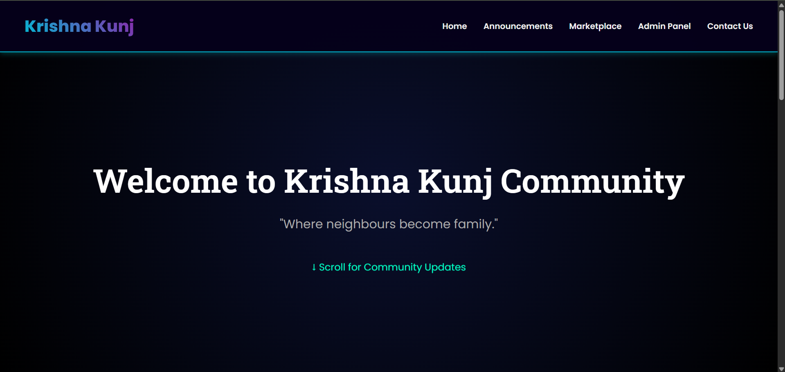
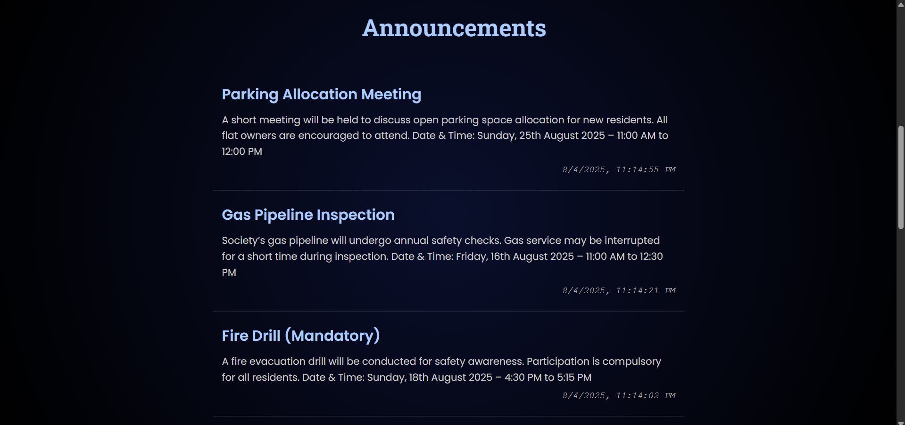
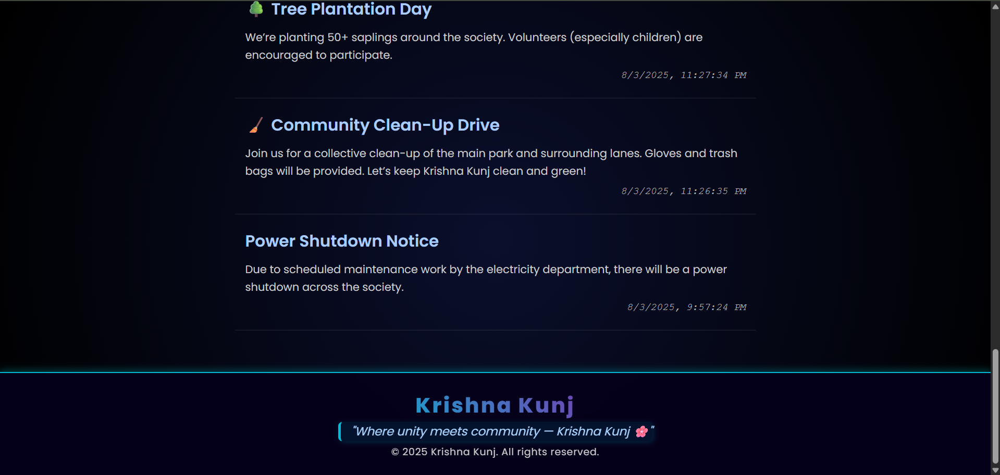

# 🏘️ Krishna-Kunj Community Board

This project was created using the assistance of advanced AI tools. It showcases the ability to plan, design, and build a complete, real-world web solution with the help of AI-powered guidance.

The **Krishna-Kunj Community Board** is a web-based platform for society members to:
- Post and view announcements
- List marketplace items for sale
- Delete old announcements or listings

It's designed to streamline communication and engagement within residential societies.

---

## 📌 Project Overview

This application includes:
- 📢 **Announcements Module**: Post and view society-related announcements like electricity issues, maintenance alerts, or event notices.
- 🛒 **Marketplace Module**: Society members can post items for sale/rent and browse listings by others.
- 🗑️ **Admin Dashboard**: Admins can view form submissions, manage contacts, and delete outdated announcements or listings.
- 📱 **Responsive UI**: Works on desktop and mobile screens, with a clean and user-friendly design.

---

## 🚀 Features

✅ Add announcements (e.g., electricity maintenance, events, notices)  
✅ Post marketplace items for sale or rent  
✅ Delete old or resolved posts  
✅ Simple, clean, and modern UI  
✅ Fully responsive layout for mobile and desktop  

---

## 🛠️ Built With

- **HTML5**, **CSS3**, **JavaScript**
- **Firebase** (for hosting & backend)
- **AI Tools** (e.g., ChatGPT for code assistance and structure)

---


## 📁 Folder Structure
```
├── index.html # Landing page
├── style.css # Global styles
├── script.js # General JS for index
├── contact_us.html # Contact form UI
├── contact.js # JS for contact form
├── market_place.html # Marketplace listings
├── market_place.js # JS for marketplace page
├── admin.html # Admin login page
├── admin_login.js # JS for admin login
├── dashboard.html # Admin dashboard page
├── dashboard.js # JS for dashboard interactivity
├── dashboard_delete_announcement.html # Delete announcements page
├── dashboard_delete_marketplace.html # Delete marketplace items page
├── dashboard_delete.js # JS for delete functionality
├── admin_view_contact.html # View contact submissions
├── admin_view_submissions.js # JS for admin viewing contacts
├── admin.css # Admin-specific styles
```

## 🧱 Folder & Core Files Explained

| File Name | Description |
|----------|-------------|
| `index.html` | Landing page with community board overview |
| `market_place.html` | Frontend UI for viewing marketplace listings |
| `market_place.js` | Handles dynamic rendering of listings |
| `contact_us.html` | Public contact form interface |
| `contact.js` | Validates and sends contact form data |
| `admin.html` | Admin login page for authorized access |
| `admin.css` | Styling for admin dashboard and login page |
| `admin_login.js` | Validates admin login credentials |
| `dashboard.html` | Admin dashboard home (navigation to all features) |
| `dashboard.js` | Controls dashboard navigation and logic |
| `admin_view_contact.html` | Admin view for contact form submissions |
| `admin_view_submissions.js` | Fetches and displays contact entries |
| `dashboard_delete_announcement.html` | Admin panel to delete announcements |
| `dashboard_delete_marketplace.html` | Admin panel to delete marketplace listings |
| `dashboard_delete.js` | Handles delete operations for both panels |
| `script.js` | Common script for general utilities and functions |
| `style.css` | Styling for public pages (marketplace, index, contact) |


---

## 🌐 Hosting

> Hosted on Firebase using `firebase deploy`  
🔗 **Live URL** (replace with yours):  
[https://krishna-kunj-community-board.web.app](https://krishna-kunj-edffe.web.app/index.html)

---

## 📸 Screenshot Section

### 🔷 `index.html` - Home Page

#### 🏠 Home Section  


#### 📢 Announcements Section  


#### 🔗 Footer Section  


---

### 🔷 `marketplace.html` - Marketplace Page

#### 🔼 Top Section  


#### 🔁 Middle Section  


#### 🔽 Bottom Section  


---

### 🔷 `admin.html` - Admin Panel

#### 🔑 Admin Login Panel  


---

### 🔷 `admin_dashboard.html` - Admin Dashboard

#### 🧑‍💼 Personal Announcement Dashboard  


#### 🛒 Marketplace Listing Dashboard  


#### 🗑️ Manage Marketplace Listings  


#### 📬 Contact Submissions View  


#### 📢 Manage Announcements  


---

## 🚀 Deployment

This project is hosted using **Firebase Hosting**. All files are properly placed in the `public/` folder (as required by Firebase), and the `firebase.json` was generated automatically by Firebase CLI.

---

## 👨‍💻 Made With Help Of

- 🧠 AI Tools (ChatGPT)
- ❤️ Passion to build for Krishna Kunj Society
